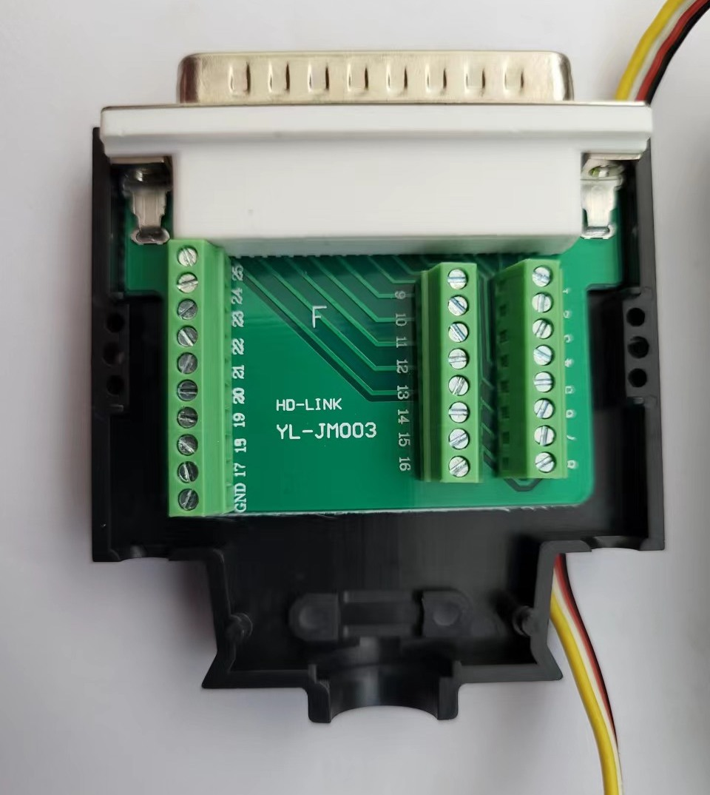
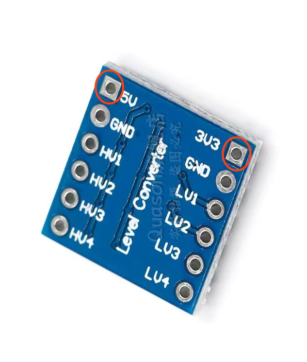
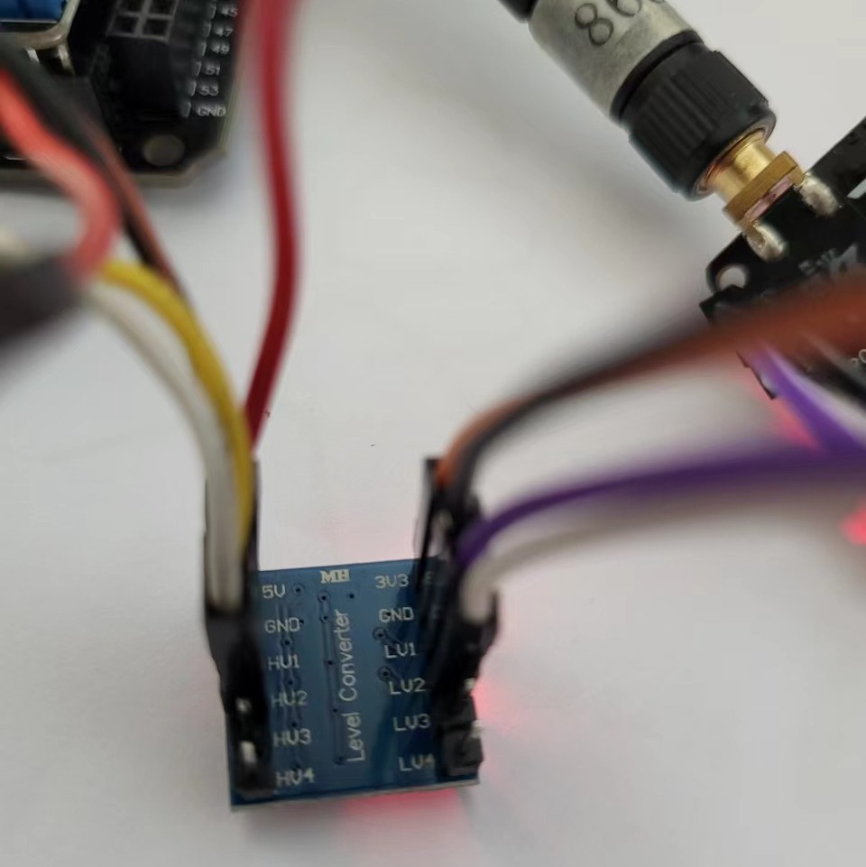
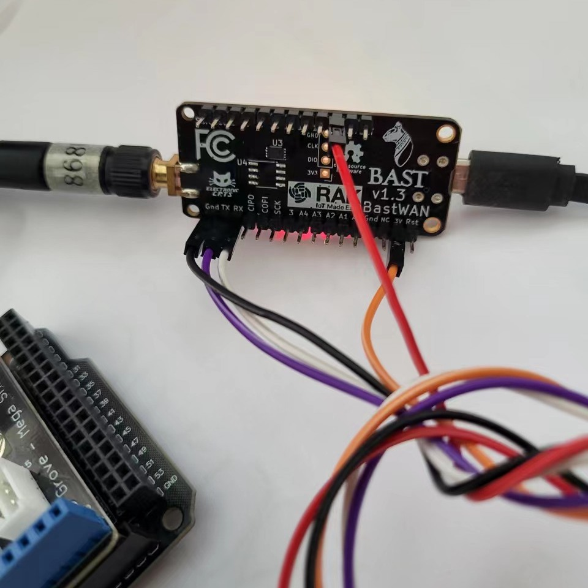
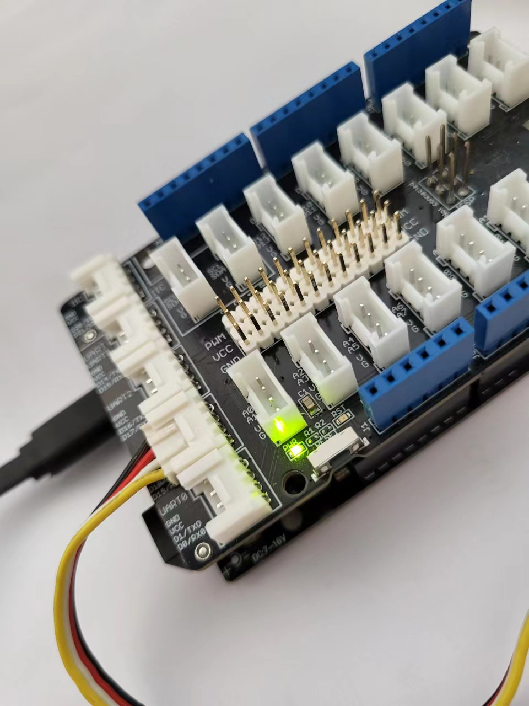
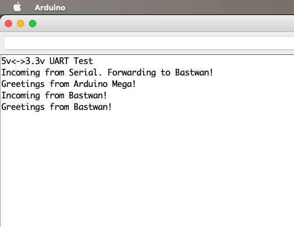
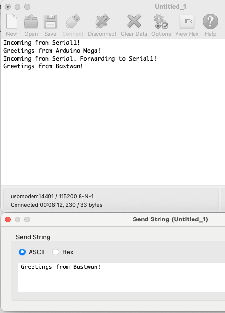

# 5v to 3.3 v Bridge

## Background

I am building a LoRa dongle specifically for a Tandy TRS-80 Model 102, a 40 year-old portable computer, arguably the first usable laptop in existence – and still going strong. It was very popular with journalists and writers, because of a combination of format (A4 size), keyboard, battery life and general convenience. Today, its specs pale in comparison with modern laptops, but it still has a strong following, and can be used for many things. I use it to write blog post drafts, this one included, but the main goal for me was to build a LoRa testing device, especially for LoRa distance tests.

In terms of connectivity it had a rich assortment back then, but today the only port that's usable is the RS-232 serial port, in its antiquated but still supported DB-25 format. There are plenty of DB-25 to DB-9 and DB-9 to USB cables, and even DB-25 to USB (yes I have a few!). So backing up and loading files is easy, albeit slow. So the temptation to create a LoRa dongle via the RS-232 port was strong, and I have taken the few steps.

While this computer can be programmer in BASIC, it is quite slow – although I suppose for a LoRa PING-PONG machine it wouldn't matter that much... – but I decided to go directly for the hard and fast option: ASM code. The 80C85 CPU running on this laptop is a cousin of 8080, and by extension of the probably most famous CPU of all times, the Z80. Learning the 8085 "dialect" wasn't too hard, and there are assemblers running on modern machines. In a couple of days I was able to verify that I could indeed send and receive strings of characters via the RS232 port.



## The Challenge

Now comes the real challenge: building a dongle. Which brings us to the subject of this blog post. Most modern IoT machines, and that's especially true for LoRa modules, run at 3.3 volts. 40 year-old devices don't. You're lucky if they output 5 volts, and not 12... That would make any LoRa chip dance a little. So while waiting for my Tandy 102 to arrive, I went shopping on Taobao for essentials: the DB-25 connector above (and a few others just in case), and some bi-directional level shifters: I found some with 2 to 8 lines, which could come in handy – RS232 doesn't just use Rx and Tx, so I might need more than 2 lines... But for the purpose of this exercice, simulating Rx/Tx between 5- and 3.3-volt machines, I stick to these 2 lines only.



Also, the other (minor difficulty) is that RS232 doesn't supply a 5-volt line per se. The signals, when HIGH, come out at 5 volts, but there's no power source for the device connected to it. 25 pins, and they couldn't provide a measly 5-v signal... Sigh... However, to function properly, the level shifter must receive 5 volts on one side, and 3.3 volts on the other. Fortunately Bastwan has a USB line, which outputs 5 volts, or a little more. So I ended up wiring both sides with lines from the Bastwan. Then GND to GND, on both sides, and Rx1/Tx1 on the Mega's side to HV1 and HV2, and Tx1/Rx1 on the Bastwan's side to LV1 and LV2. This is what it looks like. The level shifter is actually small enough to fit snugly inside the connector's casing, which would be the ideal solution.







## The Code

After that, all it requited to test was the same code for both machines (since they both have `Serial` and `Serial1`), a variant of the SoftwareSerial bridge. The code is small enough to be quoted here in its entirety:

```c
void setup() {
  Serial.begin(115200);
  Serial1.begin(115200);
  delay(5000);
  Serial.println("5v<->3.3v UART Test");
}

void loop() {
  if (Serial.available()) {
    Serial.println("Incoming from Serial. Forwarding to Serial1!");
    char buf[256] = {0};
    uint8_t ix = 0;
    while (Serial.available()) {
      char c = Serial.read();
      buf[ix++] = c;
      delay(10);
    }
    buf[ix++] = 0;
    Serial.print(buf);
    Serial1.print(buf);
  }
  if (Serial1.available()) {
    Serial.println("Incoming from Serial1!");
    char buf[256] = {0};
    uint8_t ix = 0;
    while (Serial1.available()) {
      char c = Serial1.read();
      buf[ix++] = c;
      delay(10);
    }
    buf[ix++] = 0;
    Serial.print(buf);
  }
}
```

And indeed the bridge works, without burning my Bastwan (thankfully!).





## Next Steps

Working on the RS232 protocol, and see which lines I will need to wire to be able to send and receive data. There are quite a few projects out there that interface the Tandy Model 100 or 102 with the modern world, so I'll have a look and try not to make too much of a mess.

Meanwhile, if you need to interface a 3.3-volt device to a 5-volt one, you know what to do!
