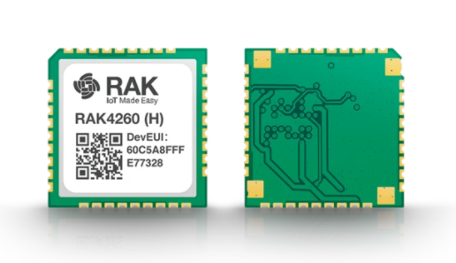
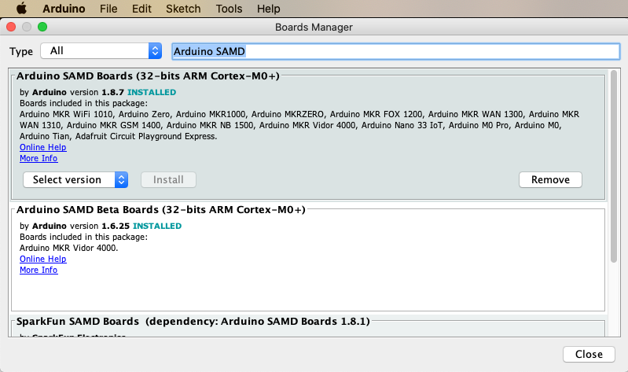
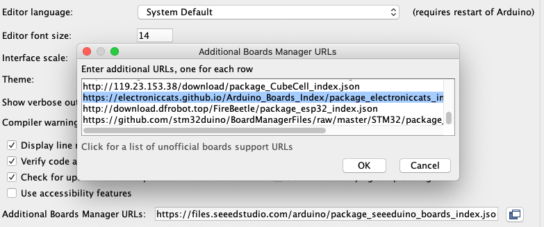
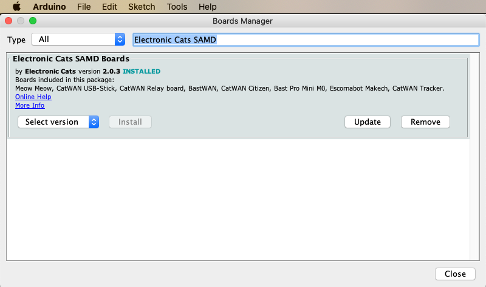
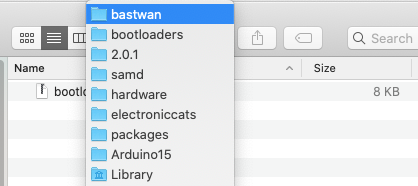
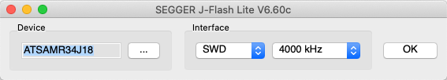
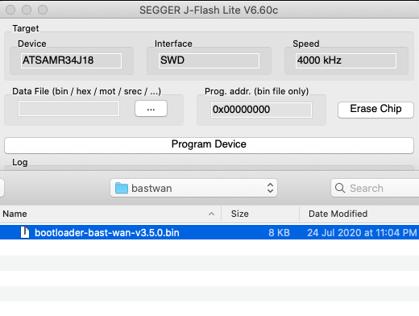
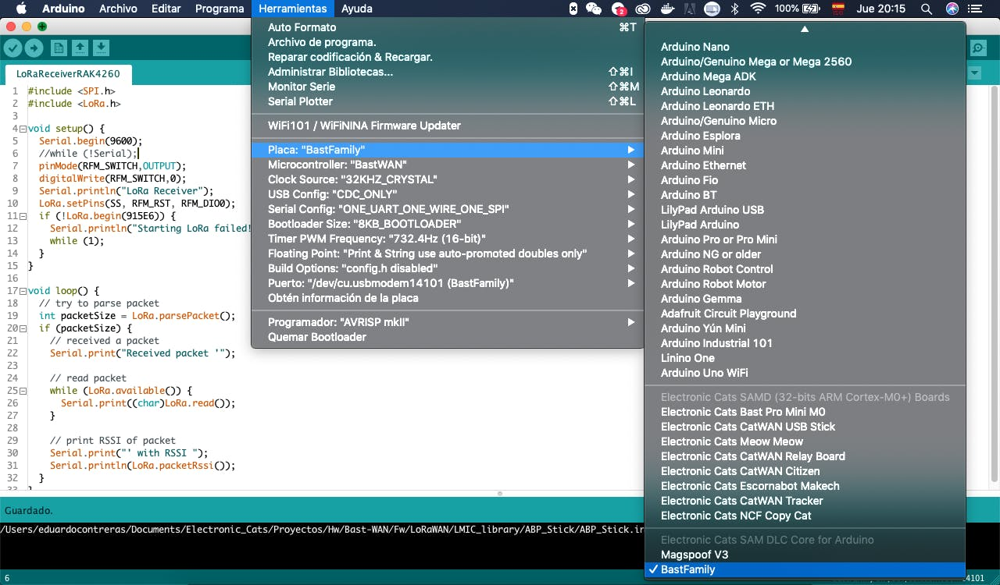
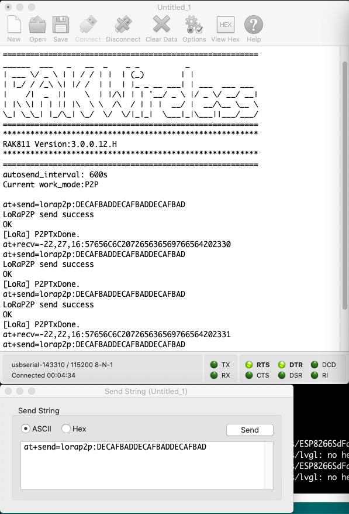

# Tutorial: Setting up and using BastWAN/RAK4260

## Introduction

In this tutorial, we will show you how to use the RAK4260 module-equipped BastWAN with the Arduino IDE. This board has been developed in cooperation with RAK Wireless in Shenzhen.

## Characteristics

* SAMR34 microcontroller, thanks to the [RAK4260](https://store.rakwireless.com/products/rak4260-lora-module).
* Low-power ARM Cortex M0+
* SPI Flash memory for future Circuit Python support
* ATECC608A Lora encryption chip
* User LED
* LiPo battery charger
* SMA connector
* Micro USB port
* Reset Button



## Install Arduino IDE

We're assuming that you have installed the Arduino IDE, version 1.6.6 or above. If not, head over to [the official website's download page](https://www.arduino.cc/en/Main/Software) and do that.

## Install the SAMD Support from Arduino

Next you'll need to install support for the SAMD processors. In the menu, go to `Tools -> Boards -> Board Manager`. Type in `Arduino SAMD` in the search filter: *Arduino SAMD Boards (32-bits ARM Cortex M0+)* will appear. Click Install.



## Install support for Electronic Cats boards

Now you need to add support for Electronic Cats boards, which will include the BastWAN. For this, you need to add the following link to your Additional Boards Manager. Go to `File -> Preferences` and copy and paste the following URL into the 'Additional Boards Manager URLs' input field, and click OK.
`https://electroniccats.github.io/Arduino_Boards_Index/package_electroniccats_index.json`



Now go back to the Boards Manager, and search for `Electronic Cats SAMD`. Click Install. Or, if you're like me, late one version, Upgrade!



## Burn the Bootloader

If you're trying to do this tutorial without a BastWAN Board you will need to burn the bootloader since the RAK4260 module by itself doesn't come with the bootloader flashed. BastWAN devices come preloaded with the bootloader. The support package for Electronic Cats boards comes with the bootloader. Depending on your machine and setup, it will be somewhere like `[...]/Arduino15/packages/electroniccats/hardware/samd/2.0.3/bootloaders/bastwan/`. In short, wherever the packages are installed, go into `electroniccats` and follow the path all the way to `bastwan`. The file is currently called `bootloader-bast-wan-v3.5.0.bin`. This is the file you need.


*the location of the bootloader on a Mac*

The bootloader is based on the UF2 from Microsoft, which allows you to reprogram it with Arduino and other platforms.

You will need a JLink, an ATMEL ICE or a Black Magic Probe. Maybe you can even do your own programer based on the Black Magic probe or with a Raspberry as a ARM programmer. There are a lot of ways to flash this chip nowadays. We'll demonstrate how with a JLink.

In JFlash Lite, select the proper MCU type, `ATSAMR34J18`.



Then select the bootloader file from your disk, and click `Program Device` to upload it to the BastWAN.



You’re done: your device can now be programmed on the Arduino IDE. It should appear in the `Tools -> Boards` menu:


*in Windows*


*on a Mac*

## Let's code!

### Hello World in LoRa:

Below you will find the code for 2 sketches. The first is for the receiver, and the second is the sender. BastWAN uses [Sandeep Mistry’s library](https://github.com/sandeepmistry/arduino-LoRa) (you could probably use others, but the examples are based on this one). Make sure you have it before starting to play with your new toy…

#### Receiver
```c
#include <SPI.h>
#include <LoRa.h>

void setup() {
  Serial.begin(9600);
  pinMode(RFM_SWITCH, OUTPUT);
  digitalWrite(RFM_SWITCH, 1);
  Serial.println("LoRa Receiver");
  LoRa.setPins(SS, RFM_RST, RFM_DIO0);
  if (!LoRa.begin(915E6)) {
    Serial.println("Starting LoRa failed!");
    while (1);
  }
}

void loop() {
  // try to parse packet
  int packetSize = LoRa.parsePacket();
  if (packetSize) {
    // received a packet
    Serial.print("Received packet '");
    // read packet
    while (LoRa.available()) {
      Serial.print((char)LoRa.read());
    }
    // print RSSI of packet
    Serial.print("' with RSSI ");
    Serial.println(LoRa.packetRssi());
  }
}
```

#### Sender

```c
#include <SPI.h>
#include <LoRa.h>

#define RFM_TCXO (40u)

int counter = 0;

void setup() {
  Serial.begin(9600);
  delay(2000); // BastWAN is slow to set up the Serial
  Serial.println("\nLoRa Sender");
  pinMode(RFM_TCXO, OUTPUT);
  pinMode(RFM_SWITCH, OUTPUT);
  pinMode(LED_BUILTIN, OUTPUT);
  LoRa.setPins(SS, RFM_RST, RFM_DIO0);
  if (!LoRa.begin(915E6)) {
    Serial.println("Starting LoRa failed!");
    while (1);
  }
}

void loop() {
  Serial.print("Sending packet: ");
  Serial.println(counter);
  digitalWrite(LED_BUILTIN, 1);
  // send packet
  LoRa.beginPacket();
  digitalWrite(RFM_SWITCH, 0);
  LoRa.print("hello ");
  LoRa.print(counter);
  LoRa.endPacket();
  counter++;
  delay(500);
  digitalWrite(LED_BUILTIN, 0);
  delay(500);
}
```

In both examples the variables *RFM_SWITCH, RFM_RST, RFM_DIO0, * and *SS* are declared in the board definitions, so you don't need to use the pin numbers. But `RFM_TCXO` isn't, for some reason, so I had to add it. Thanks to [Titi](https://github.com/titimoby) for catching this.

#### Hello World in LoRaWAN:

Below you will find an example using the BastWAN as a LoRaWAN Class A device with ABP activation. This is just an example but in order to use it correctly, you will need to read the documentation of the library, because you will depend on the configurations of your LoRaWAN gateway and you need to configure it correctly in order to get this working.

You will need to put your LoRaWAN credentials to get access to your LoRaWAN server. Remember: the DEV EUI is printed on the module itself.

In the examples the variables *SS, RFM_SWITCH, RFM_RST, RFM_DIO0, RFM_DIO1 RFM_DIO2, RFM_DIO3, RFM_DIO4, RFM_DIO5* are declared in the board definitions, so you don't need to use the pin numbers.

```c
/**
* Example of ABP device
* Authors:
*        Ivan Moreno
*        Eduardo Contreras
*  June 2019
*
* This code is beerware; if you see me (or any other collaborator
* member) at the local, and you've found our code helpful, 
* please buy us a round!
* Distributed as-is; no warranty is given.
*/
#include <lorawan.h>

//ABP Credentials
const char *devAddr = "00000000";
const char *nwkSKey = "00000000000000000000000000000000";
const char *appSKey = "00000000000000000000000000000000";
const unsigned long interval = 10000; // 10 s interval to send message
unsigned long previousMillis = 0; // will store last time message sent
unsigned int counter = 0; // message counter
char myStr[50];
char outStr[255];
byte recvStatus = 0;

const sRFM_pins RFM_pins = {
  .CS = SS, 
  .RST = RFM_RST, 
  .DIO0 = RFM_DIO0, 
  .DIO1 = RFM_DIO1, 
  .DIO2 = RFM_DIO2, 
  .DIO5 = RFM_DIO5, 
};

void setup() {
  // Set up LoRaWAN access
  Serial.begin(115200);
  delay(2000);
  if(!lora.init()){
    Serial.println("RFM95 not detected");
  delay(5000);
  return;
  }
  // Set LoRaWAN Class change CLASS_A or CLASS_C
  lora.setDeviceClass(CLASS_A);
  // Set Data Rate
  lora.setDataRate(SF8BW125);
  // set channel to random
  lora.setChannel(MULTI);
  // Put ABP Key and DevAddress here
  lora.setNwkSKey(nwkSKey);
  lora.setAppSKey(appSKey);
  lora.setDevAddr(devAddr);
}

void loop() {
  // Check interval overflow
  if(millis() - previousMillis > interval) {
  previousMillis = millis();
  sprintf(myStr, "Counter-%d", counter);
  Serial.print("Sending: ");
  Serial.println(myStr);
  lora.sendUplink(myStr, strlen(myStr), 0);
  counter++;
  }
  recvStatus = lora.readData(outStr);
  if(recvStatus) {
    Serial.println(outStr);
  }
  // Check Lora RX
  lora.update();
}
```

#### Extra LoRa examples:

Download the [Bast-Wan repository](https://github.com/ElectronicCats/Bast-WAN) on GitHub, or, better, clone it and keep it updated. You’ll find some examples that will help you get started. Here's an example of a BastWAN device communicating via LoRa P2P with another RAK device, the WisNode LoRa Arduino Shield. The WisNode is connected to a Mac via USB, sending AT commands manually, to test reception.



The code by Kongduino is on GitHub [here](https://github.com/Kongduino/BastWAN_WisNode).

## Schematics

The schematics are available [here (PDF)](https://hacksterio.s3.amazonaws.com/uploads/attachments/1052571/bast_wan_zYRKiwCBxk.pdf)

## Links & References

* [Hackster Blog post](https://www.hackster.io/electronic-cats/how-to-use-rak4260-with-arduino-ide-4bcff2)
* [Additional Boards Manager to install BastWan in Arduino IDE](https://electroniccats.github.io/Arduino_Boards_Index/package_electroniccats_index.json)
* [LoRa library](https://github.com/sandeepmistry/arduino-LoRa)
* [Bast-Wan repository](https://github.com/ElectronicCats/Bast-WAN)
* [Kongduino's blog post](https://kongduino.wordpress.com/2020/07/24/bastwan/)
