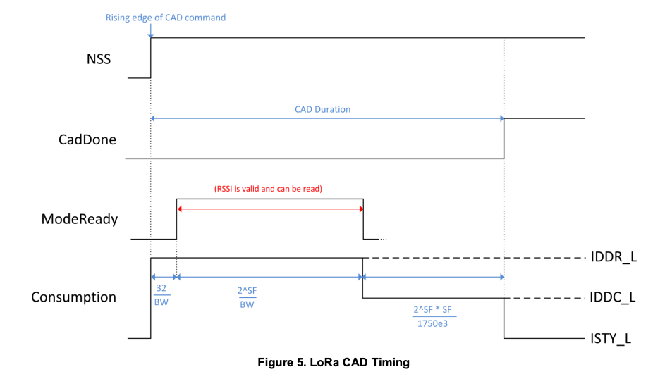

# Channel Activity Detection: How to ensure your LoRa packets are sent properly

## Background

Currently, most of the LoRa® networks, either ad-hoc peer-to-peer (P2P) networks, or under the LoRaWAN® specification, use an [ALOHA](https://en.wikipedia.org/wiki/ALOHAnet#Pure_ALOHA) media access control mechanism, on a set of parameters (radio frequency (Freq), bandwidth (BW) and spreading factor (SF)), regardless of whether another device is already transmitting, which could result in a collision. While ALOHA allows for a simple network implementation, it can't keep up with the increasing demand of IoT devices. Even if devices conform to channel usage limitations (a 0.1% or 1% duty cycle in Europe), ALOHA-based networks will have collisions when facing millions of devices that will come with the growth of IoT networks.

The use of a spread spectrum modulation technique presents challenges in determining whether the channel is already in use before transmitting a frame.  
As a LoRa receiver can demodulate signals below its noise floor, using the RSSI would clearly be impracticable. Instead, the Channel Activity Detector (CAD) is used to detect the presence of other LoRa signals.

The Channel Activity Detection feature available within the whole family of LoRa radios presents a possible CSMA mechanism for LoRa networks. CAD is an energy-efficient way to detect an incoming frame without resorting to a power-hungry continuous receiving mode. Prior to performing a CAD, the LoRa radio is set on the desired Freq, SF and BW. The radio then switches to the CAD mode and performs a CAD operation, which lasts `[Tsymbol + (32/BW)]` milliseconds, during which the radio performs a receive operation correlation on the received samples. `Tsymbol` is the duration that is the airtime of a single LoRa chirp, depending on the SF value.

The CAD mode available on all of LoRa radios[^1] is primarily designed for energy-efficient preamble detection. Although preamble detection is not a full-fledged carrier sense, CAD, can detect reliably and power efficiently payload chirps of an ongoing transmission.

## The CAD operation
The CAD operation itself involves the radio module listening, at the preset frequency and SF/BW settings, for a LoRa preamble. If it finds that, it returns an interruption to the host MCU. Starting with the SX128x, the LoRa module can also try to listen further in order to detect whether it is a LoRa packet *per se,* not the preamble. Again, if it is detected, it will return an interrupt. If not, the host MCU receives an all-clear status, and the user can proceed with the transmission.


From *SX1272/3/6/7/8: LoRa Modem, Low Energy Consumption Design* by Semtech.

**Example on SX127x**

When the CAD operation starts, the first 32/BW ms are not available for use. Then during (2^SF)/BW ms the RSSI is valid and readable. The chip calls the ModeReady interrupt. At the end of ModeReady signal, there is a short processing time, (2^SF*BW)/1,750e3, spent at a reduced consumption level. Once the channel activity detection process is complete, the radio returns to standby mode and the CadDone interrupt is set. At this point, the CadDetected interrupt can be checked – indicating the presence, or otherwise, of a valid preamble upon which to wake the receiver.  
Note: The radio returns to standby mode to allow the CadDetected and CadDone interrupts to be read, these are
then cleared automatically upon returning to sleep mode.

## In Practice

If you're not an RF engineer, how does this work in practice? Basically, if you've been doing LoRa P2P transmissions, or had a look at ping-pong code, you will have noticed that most of the time, the code sending a packet just starts transmiting data by sending it to the LoRa chip, which triggers the transmission. What happens next is left to the LoRa chip.

Likewise, receiving packets is handled synchronously: you ask the LoRa chip whether there's anything coming in, and if there is, you read from it. If not, you skip, until the next time. This usually happens in the main `loop()`, or similar, depending on the framework you use.

With CAD, not so much. You can have a code example that has a completely empty main `loop()`, and still be properly functional while saving power: the secret is to set up a `CadDone()` callback on interruption, which will handle the result of a CAD operation. Likewise, you set up callbacks for all receive (RX) and transmit (TX) events (RxDone, RxError, TxDone, TxError).  
Now say that you want to implement a LoRa device that sends a small set of data every xx minutes, such as a sensor pod in a farm. Sounds easy. The issue might appear when you don't have one pod, but hundreds of them. And even if you stagger the transmissions, hundreds data packets within few minutes, for a transmission time of 20 to 30 seconds, things are going to get messy, and you will probably have some collisions leading to packet loss... This is where CAD shines as a device will detect ongoing transmissions before sending its packet.

### Setting up radio events on a RAK4631 (SX1262 based module)

```c
  // Initialize the Radio callbacks
  RadioEvents.TxDone = OnTxDone;
  RadioEvents.RxDone = OnRxDone;
  RadioEvents.TxTimeout = OnTxTimeout;
  RadioEvents.RxTimeout = OnRxTimeout;
  RadioEvents.RxError = OnRxError;
  RadioEvents.CadDone = OnCadDone;
  // Initialize the Radio
  Radio.Init(&RadioEvents);
```

So instead of sending data packets unconditionally, when it's time to send, you ask for a CAD operation. When complete, the CAD operation returns a status code: busy or available. If the channel is busy, you queue the transmission and try again later. If it's free, you send the data – and wait until the `TxDone` callback is called to remove that packet from the queue. Be aware than another device might have started a transmission between the time you did the CAD operation and the time you started the transmission, which is why time randomization is always recommended. Here's what the whole process looks like:

### Sending a LoRa packet with CAD, based on RAK framework

```c
/**
   @brief main send function that sets things up for sending.
*/
void send() {
  // Set up a buffer of 64 bytes with a string, and the remainder made up
  // of random bytes to make a big packet that shows up nicely on an SDR.
  sprintf((char*)TxdBuffer, "Received at RSSI %d, SNR %d", myRSSI, mySNR);
  uint8_t bufLen = strlen((char*)TxdBuffer) + 1;
  uint8_t remainderLen = 64 - bufLen;
  fillRandom(TxdBuffer + bufLen, remainderLen);
  Serial.println("Sending:");
  // Show the buffer in hex format
  hexDump(TxdBuffer, 64);
  Radio.Standby();
  // Set up CAD
  Radio.SetCadParams(LORA_CAD_08_SYMBOL, LORA_SPREADING_FACTOR + 13, 10, LORA_CAD_RX, 0);
  // To determine how long the CAD operation took. Optional.
  cadTime = millis();
  // Add some time randomization to avoid sync between devices.
  delay(random(300));
  Radio.StartCad();
}

/**
   @brief CadDone callback: is the channel busy?
*/
void OnCadDone(bool cadResult) {
  time_t duration = millis() - cadTime;
  if (cadResult) {
    // true = busy / Channel Activity Detected
    Serial.printf("CAD returned channel busy after %ldms\n", duration);
    // At this junction we should re-schedule a send. Here, we'll just ignore.
  } else {
    Serial.printf("CAD returned channel free after %ld ms\nSending...", duration);
    // Good to go: let's send!
    Radio.Send(TxdBuffer, 64); // strlen((char*)TxdBuffer)
    Serial.println(" done!");
  }
}

/**
   @brief Function to be executed on Radio Tx Done event
*/
void OnTxDone(void) {
  Serial.println("OnTxDone");
  Radio.Rx(RX_TIMEOUT_VALUE);
}

/**
   @brief Function to be executed on Radio Tx Timeout event
*/
void OnTxTimeout(void) {
  Serial.println("OnTxTimeout");
  Radio.Rx(RX_TIMEOUT_VALUE);
}
```


Footer: Semtech, the Semtech logo and LoRa® are registered trademarks or service marks, and LoRa Cloud™ is a trademark or service mark of Semtech Corporation or its affiliates.

[^1]: The SX127x radio family is only able to detect the preamble, all others LoRa products (SX126x, SX128x, LR11xx) can detect the full packet without host MCU involvement.