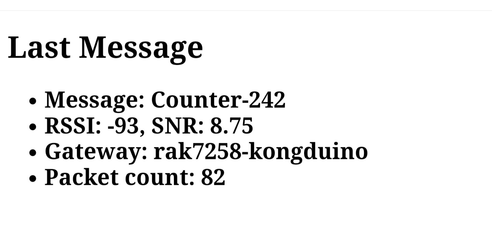
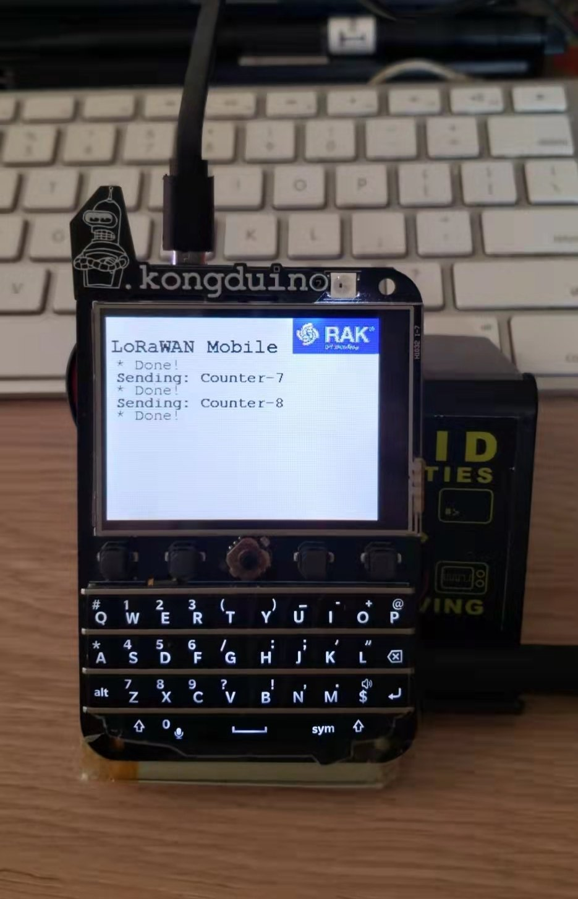
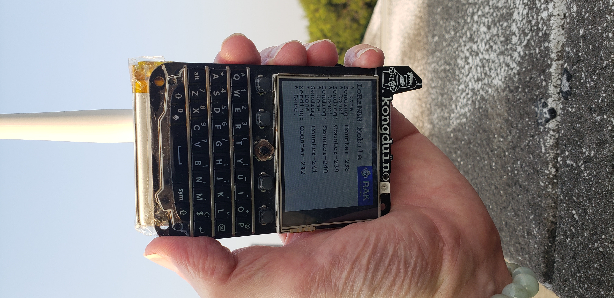
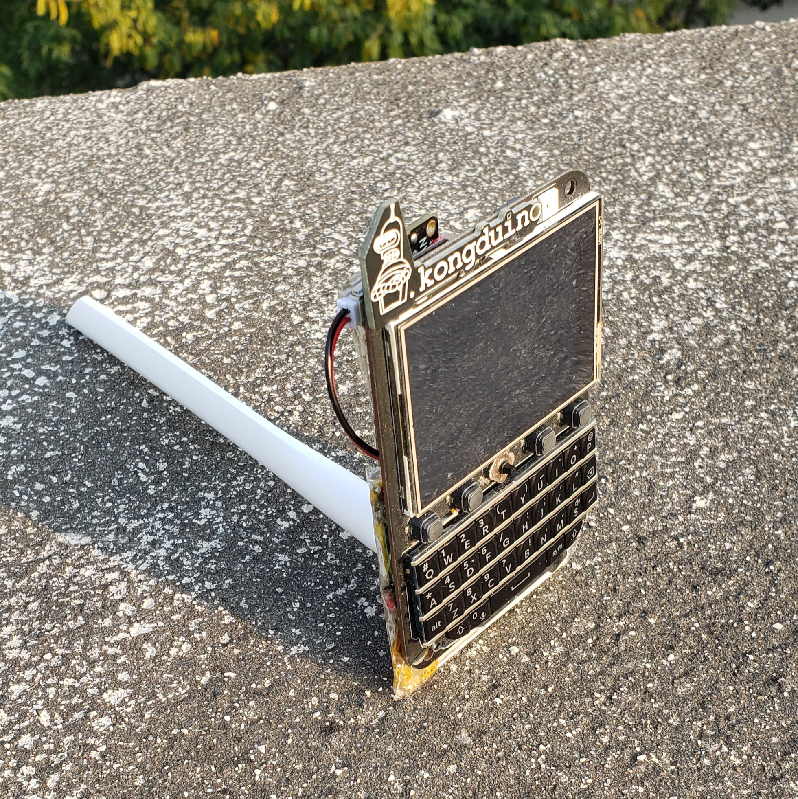
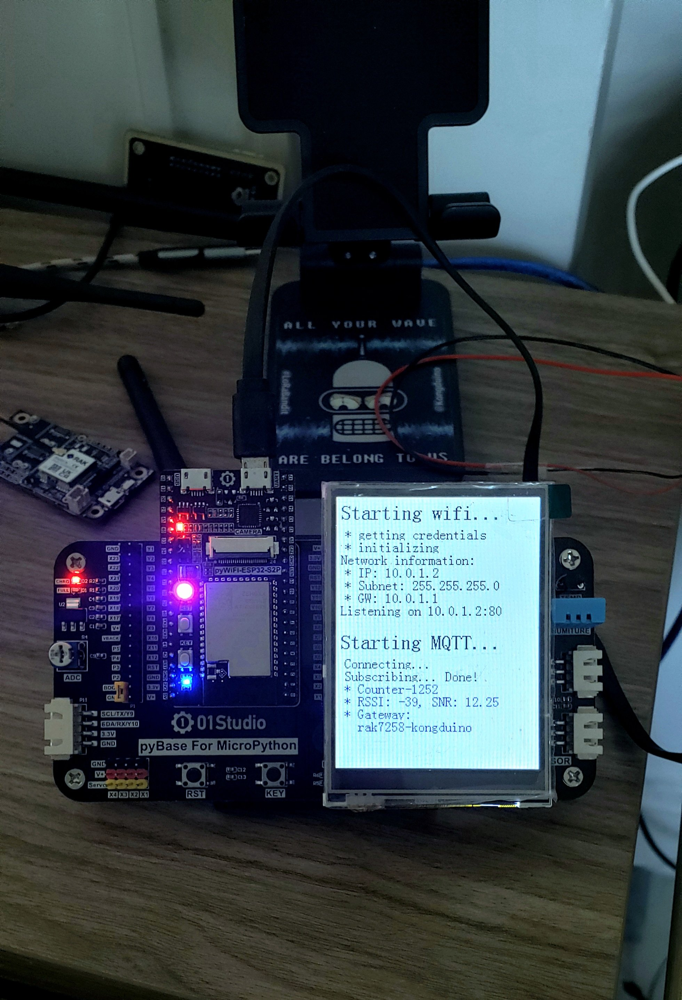

# Setting up a LoRaWAN Distance Test

One question we get a lot at RAK (and, I suppose, at other companies making LoRa equipment) is "How far does it go?" We can also give figures – and often do – but it's nice to be able to back it up with actual numbers, gathered in real-life situations. My first real-life LoRa distance test was a few months before I joined RAK – I was hanging out a lot with RAK people already – and we decided to do a test with 3 teams: one in Shenzhen with a gateway, set to work on P2P mode, on a hill; one at sea level in Shenzhen Bay with a RAK811 tracker; and another gateway in P2P mode, in a car, in Lau Fau San, in Hong Kong.

It was fun to do, and we had some good results – about 10 km between gateway and node, and 13 km gateway to gateway. On my own, with small ESP32+SX1278 modules, I had never been above 2 km. Then again, I didn't live on a hill! Now I do, kind of. And I have better tools. I have been doing lots of P2P distance tests, refining LoRa settings to get a little extra oomph, and so far have reached 10.2 km (I'm running out of land, and terra firma after that is an extra 8 km away!). So it was now time to try with LoRaWAN, which is a little trickier, as I have less control on settings, what with fair use and all that. So it would be interesting to see how it worked out.

## The setup

Since LoRaWAN is mostly one-way, from node to gateway, onwards to the cloud, I needed a way to check, more or less instantly, that the packets had been received. The easiest solution is to enable MQTT integration on TTN, and subscribe to the feed. That feed can be parsed, the relevant extracted, and either sent back, logged to a file, or served in a basic HTTP server. I decided to do the last two: keep a log of it, but set up an ESP32 with a basic HTTP server, with just a static file listing the latest packet and its data. So while outside I can check the server from my phone, while watching the testing device send its packets.



I live in a neighborhood that's full of what I call "Godzilla buildings": imagine about 200+ towers, between 30 and 50 floors high, squished together in islands of 8 to 10 towers. Lots of ferro-concrete that interfere with ground floor RF reception! But we make do. Originally, I lived in a low floor, about 15 meters up. Last year, I moved to the top floor, and I have some of the best conditions I could wish for. 150 meters up, I have a straight Line of Sight onto the next hood, 10 km away, and, with a horizon about 41 km away, the sky's literally the limit. The mountains in the background are about 25 km away, and have been taunting me for a while now.


For the testing device, I converted my P2P messenger, aka the BastMobile, to an automated LoRaWAN packet sender. Composed of a [BastWAN](https://store.rakwireless.com/products/rak3244-bastwan-breakout-board) (a Feather form-factor board designed by our Mexican friends at [Electronic Cats](https://electroniccats.com/store/bastwan/), around the RAK4260 chip) and the Keyboard Featherwing, a brilliant rig that transforms a Feather board into a device reminiscent of the Blackberry™ phones of old (would it be only because the keyboard itself is actually a recycled Blackberry™ keyboard!), this setup enables me to send PING or custom packets to a receiver at my home, and received packets. An optional GPS device gives me the location, and thus the distance. You can have a look at some of my [original blog posts about BastWAN](https://kongduino.wordpress.com/tag/bastwan/).



So I coded a simple LoRaWAN OTAA sketch in Arduino IDE, adding a modicum of GUI to show what was happening. I have a bunch of square, flat, 2500-mAh batteries that fit right at the back, so I have a nice, portable device to test. The SMA connector enables me to add the antenna of my choice without too much fuss, with the proviso that since the SMA connector is pointing downwards, when I need to get the best possible conditions, I need to hold the BastWAN upside-down. But that's a minor inconvenience, and often I get good enough coverage in more traditional positions.



-93 RSSI



vs -110 RSSI

That [white antenna](https://store.rakwireless.com/collections/antennas-1/products/blade-antenna?variant=40475440873670) (it also exists in black, but it came with my [Wisgate Edge Lite](https://store.rakwireless.com/collections/wisgate-edge/products/rak7258-micro-gateway?variant=39942876561606), which is off-white) is THE BOMB. About 18 cm long, it's nowhere near as big as some of the antennas I have been using (up to 26 cm), but the fact that it is tuned for a very narrow band (either 902-928, or 863-870 MHz) makes it much more sensitive. At 6 km I was getting RSSI -93 and 8.75 SNR. It is so far the best *portable* antenna I have used (and I have a few, to say the least...). At 7.5 km I got around RSSI -104, and a wide range of SNR between +2.5 and -10.

## Let's see some code!

### MQTT Client

The code for the MQTT client + server is [on Github](https://github.com/Kongduino/test-ttn-mqtt). It is written in Micropython, and is slightly board-specific, but should be adaptable easily. It runs on an ESP32-S2 board by [01Studio Lab](https://docs.01studio.cc/esp32-s2/quickref.html). Nice family of boards – I own just about the whole family, my favorites so far being the nRF52840 running either CircuitPython or Arduino IDE code (I don't think the guys at 01Studio expected that!) and the TKM32F499 (an STM32 clone), a beast that provides a lot of oomph for the price. I attached RAK modules to all of them (the ones they use so far are, well, not the best), communicating with them on Serial via the AT firmware. Easy coding, and reliable.

But here the ESP32-S2 is not running (yet!) a RAK module. It's at home, running the umqtt.simple2 client, and a basic server. Pretty simple stuff.



```python
naeyong = "No message so far!"
html = """HTTP/1.1 200 OK
Content-Type: text/html

<!DOCTYPE html>
<html>
    <head><title>ESP32 MQTT Server</title></head>
    <body><h1>Last Message</h1><h2>response</h2>
    </body>
</html>
"""

[...]

# Received messages from subscriptions will be delivered to this callback
def sub_cb(topic, msg, retain, dup):
    global packetCount, naeyong, py
    packet = ujson.loads(msg)
    if "uplink_message" in packet.keys():
        packetCount += 1
        print("* Message "+str(packetCount)+" received:")
        u=packet["uplink_message"]
        rx=u["rx_metadata"]
        msg = ubinascii.a2b_base64(u["frm_payload"]).decode()
        naeyong="<ul><li>Message: "+msg+"</li><li>RSSI: "+str(rx[0]['rssi'])+", SNR: "+str(rx[0]['snr'])
        naeyong += "</li><li>Gateway: "+rx[0]['gateway_ids']['gateway_id']+"</li>"
        naeyong += "<li>Packet count: "+str(packetCount)+"</li></ul>"
    Color_buf(INDIGO)

def client_handler(client):
    global naeyong
    response = html.replace('response', naeyong)
    client.send(response)
    time.sleep(1)
    client.close()
```

So the code has basically three parts: an `html` variable that's the static page, and a `naeyong` variable that holds the latest message data, if available; the `sub_cb` callback that parses the packet, and updates `naeyong` if we have an uplink messagel and the `client_handler` callback that handles HTTP connections, and sends the `html` variable, updated with `naeyong`. Everything else, and it's a 200-line short code, is cosmetic.

### BastMobile code

It is also fairly simple and adapted from sample code in the Beelan library – so much so that I left their copyright notice! I changed what was needed and added TFT and LED feedback code (to show whether the device has joined the network, or is still trying; and to show when it is sending a packet), and that was about it...

You can find it [on GitHub](https://github.com/Kongduino/BastWAN-send-class-A-OTAA) too.