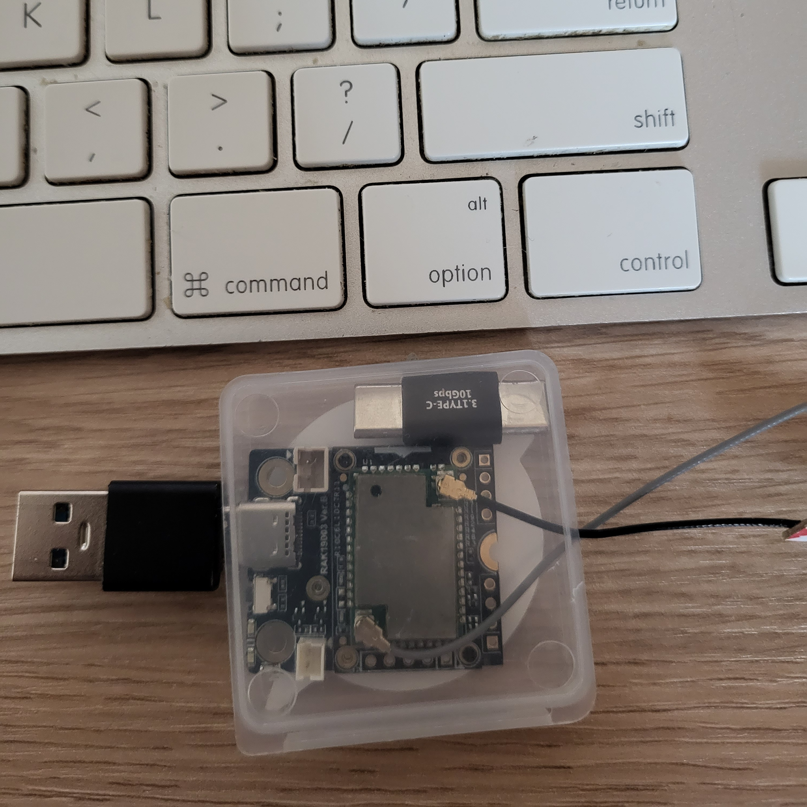
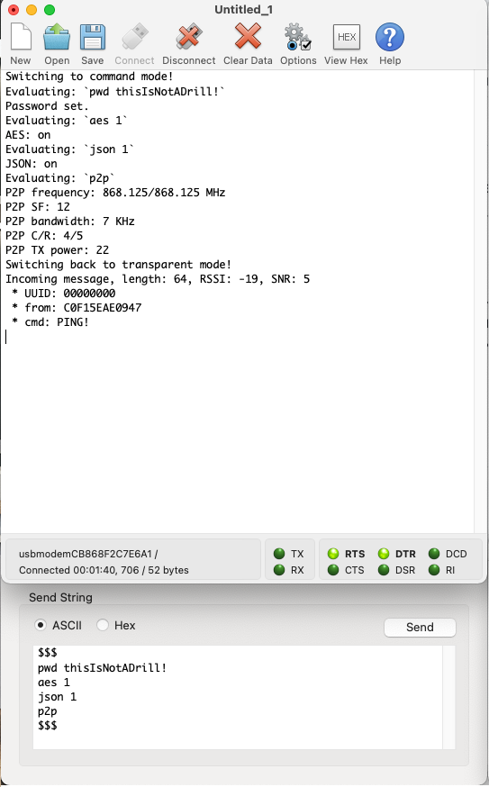
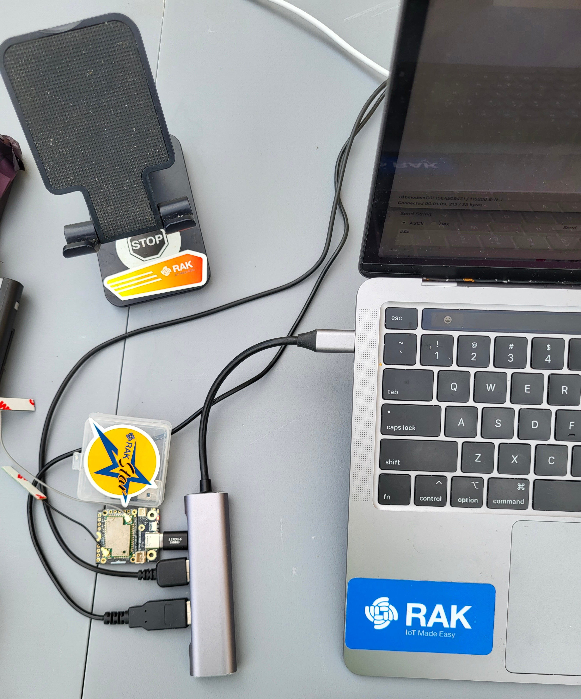
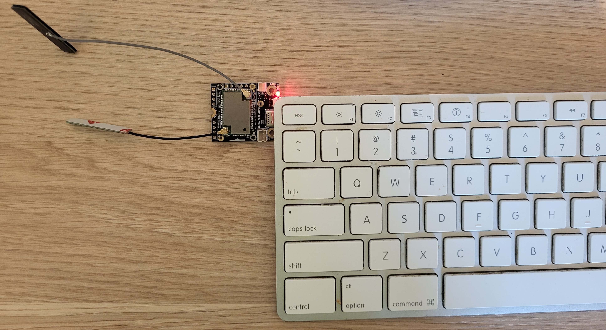

# LoRa Companion: How to make a LoRa Dongle for your computer with RUI3

While LoRa and LoRaWAN have penetrated the IoT world, providing an easy-to-use long-range communication solution, computers are by and large ignored. Rare is the laptop with a LoRa module included. But some solutions have started to pop up, at various price points. I have been making custom LoRa USB dongles for a while now, connected to either my laptop, or a Raspberry Pi, providing a great alternative to squinting at minuscule OLED displays. Most of the time, they're set up to work from home, yeah them too..., as transceivers in a PING/PONG scheme. But sometimes, they make for a convenient test platform as receivers: sit outside with a laptop, send commands, log results, etc.

Wisblock has made it not only possible, but easy. I have two kinds of dongles, with custom software either on the computer (managing the LoRa module's AT firmware), or on the LoRa module, doing most of the work, whereas the computer is just a dumb terminal. Today we're going to do the latter, making a simple custom firmware for the RAK4631-R, ie with RUI3.

## Requirements

We will need the following:

### Hardware

* A [RAK4631-R](https://store.rakwireless.com/products/rak4631-lpwan-node?variant=41771832410310) in a frequency range that's allowed in your country.

    *(Note that we could also use a RAK3172 for this, as RUI3 code compiles for both – as long as you are using supported features: eg BLE and hardware encryption are not supported for RAK3172. But here we are going to encrypt our LoRa packets, and adding AES128 to the code would go beyond the scope of this article.)*
* A baseboard: for this exercice, I chose the [RAK19003](https://store.rakwireless.com/products/wisblock-base-board-rak19003), which presents the smallest footprint, 30 x 35 mm.
* A USB cable (USB-C for the RAK19003).

### Software

* Arduino IDE.
* A terminal application, like [CoolTerm](https://freeware.the-meiers.org/), my favorite, although even Arduino IDE's Serial Terminal will do in a pinch.

And that's it. At least for a basic setup. We could of course spruce it up with a custom application on the computer, but again that's beyond the scope of this article.

## Working modes

A dongle needs basically two working modes: a transmission mode and a setup mode. Contrary to AT firmwares, which are essentially single-mode, ie they're always in setup mode, where even sending and receiving is a command, a default transmission mode acts as a bridge between the LoRa module and the USB port: whatever comes in one way is output the other. Only when the user issues a special command does the dongle switch between transmission and setup mode. I have seen some LoRa modules that do this – albeit modules targeting IoT devices, not computers – by supplying a pin or two for this purpose. Set it/them high/low and you can switch modes. But that's not exactly possible with a computer. So a special string, unlikely to happen normally, is the way to do it. In the old days of modems, `$$$` was often that "unlikely" string. So let's use this.

### Workflow

In a regular LoRa application, the workflow will often be like this:

* Initialize Serial.
* Set up Wire, then the LoRa module (pin assignments, etc).
* Set up LoRa options (SF, BW, Frequency, etc).

Here with RUI3, we can drop the 2nd point, as it is already done for us by the API: batteries included, as they say. `api.lorawan` is there for you to adjust LoRa options. The LoRa module is pre-wired (it's ours, we know what to do!). So setting up LoRa is a few lines of API calls, checking on the result:

```c
  bool rslt = api.lorawan.nwm.set(0);
  if (!rslt) {
    // Do something
  }
  rslt = api.lorawan.pfreq.set(myFreq);
  if (!rslt) {
    // Do something
  }
  rslt = api.lorawan.psf.set(sf);
  if (!rslt) {
    // Do something
  }
  rslt = api.lorawan.pbw.set(bw);
  if (!rslt) {
    // Do something
  }
  // etc etc etc...
```

That is a nice improvement on the days of setting up pin assignments, calling a library (one among a few, with varying degrees of flexibility, and differing syntax), and checking whether things work before even being able to set up the options. Here, it's pre-done, and the API is consistent.

Then you set up the LoRa callbacks: receive and transmit. This enables you to offload the code managing these events to a separate part of the code, in an asynchronous manner, instead of bloating the main `loop()` code.

```c
  api.lorawan.registerPRecvCallback(recv_cb);
  api.lorawan.registerPSendCallback(send_cb);

  rslt = api.lorawan.precv(65534);
```

The last line sets the LoRa module into permanent listen mode.

So this takes care of `setup()`. You can add a few niceties, like if you want an OLED to check on the status, without having to switch windows, or set up LEDs (there are 2 available on the board, 1 green and 1 blue). But all in all, you are ready. So what happens next?

### loop()

In `loop()` you check the Serial port for incoming characters, and act on it accordingly. More in a minute about this. But you also need to check on the LoRa module, and if it has a packet of data for you, you send the contents to the Serial port. As I mentioned before, a bridge between the two parts. This is often done, in other frameworks, the same way as for Serial. Poll the LoRa module, and if there's something, read it. Not in RUI3. This is done in the `void recv_cb(rui_lora_p2p_recv_t data)` event declared above. There you can decide what to do with the raw data before sending it to Serial. For instance, if you are expecting JSON data, you could unpack and pretty-print it to Serial. Likewise, if you know the data is encrypted, or expect it to be, you can do decrypt there before further processing. The callback looks like this:

```c
void recv_cb(rui_lora_p2p_recv_t data) {
  uint16_t ln = data.BufferSize;
  char plainText[ln + 1] = {0};
  char buff[92];
  sprintf(buff, "Incoming message, length: %d, RSSI: %d, SNR: %d", data.BufferSize, data.Rssi, data.Snr);
  Serial.println(buff);
  if (needAES) {
    // Do we need to decrypt the data?
    int rslt = aes.Process((char*)data.Buffer, ln, myIV, myPWD, 16, plainText, aes.decryptFlag, aes.ecbMode);
    if (rslt < 0) {
      Serial.printf("Error %d in Process ECB Decrypt\n", rslt);
      return;
    }
  } else {
    // No? Just copy the data
    memcpy(plainText, data.Buffer, ln);
  }
  // The easiest way to know whether the data is a JSON packet is to try and decode it :-)
  StaticJsonDocument<200> doc;
  DeserializationError error = deserializeJson(doc, plainText);
  if (!error) {
    JsonObject root = doc.as<JsonObject>();
    // using C++11 syntax (preferred):
    for (JsonPair kv : root) {
      sprintf(buff, " * %s: %s", kv.key().c_str(), kv.value().as<char*>());
      Serial.println(buff);
    }
    return; // End for JSON messages
  }
  // There was an error, so this is not a JSON packet – not well-formed anyway.
  // Print it as a plain message
  Serial.println("Message:");
  Serial.println(plainText);
}
```

### Tx

There is a callback for Tx too, which is called when the transmission is complete. You can add stuff there, but basically its only use in a normal use-case is to make sure the module goes back to listening mode:

```c
void send_cb(void) {
  // TX callback
  Serial.println("Tx done!");
  isSending = false;
  // Flag used to determine whether we're still sending something or we're free to send.
  api.lorawan.precv(65534);
}
```

We'll keep the callback short and sweet, no need to prolong the return to listening mode.

### Setup mode

When the user sends `$$$` (followed by `\n`), the code switches to setup mode. This part is slightly more complex, and I am re-using a command system I use just about everywhere. It is very easy to reuse, and most of the work is copy-paste and changing function names and creating the appropriate code for each command. Here is the structure. First we have a `struct` for commands:

```c
int cmdCount = 0;
struct myCommand {
  void (*ptr)(char *); // Function pointer
  char name[12];
  char help[48];
};
```

(`cmdCount` will come in handy in a minute). A pointer to the function, a name, and a help description. An array of commands is then declared:

```c
myCommand cmds[] = {
  {handleHelp, "help", "Shows this help."},
  {handleP2P, "p2p", "Shows the P2P settings."},
  {handleFreq, "fq", "Gets/sets the working frequency."},
  {handleBW, "bw", "Gets/sets the working bandwidth."},
  {handleSF, "sf", "Gets/sets the working spreading factor."},
  {handleCR, "cr", "Gets/sets the working coding rate."},
  {handleTX, "tx", "Gets/sets the working TX power."},
  {handleAES, "aes", "Gets/sets AES encryption status."},
  {handlePassword, "pwd", "Gets/sets AES password."},
  {handleIV, "iv", "Gets/sets AES IV."},
  {handleJSON, "json", "Gets/sets JSON sending status."},
};
```

So far so good. So at startup, in the `setup()` function, the number of available commands will be calculated, so that we know how many we have. `cmdCount = sizeof(cmds) / sizeof(myCommand);` This is used in the `evalCmd` function to loop through the commands.

```c
void evalCmd(char *str, string fullString) {
  uint8_t ix, iy = strlen(str);
  for (ix = 0; ix < iy; ix++) {
    char c = str[ix];
    // lowercase the keyword
    if (c >= 'A' && c <= 'Z') str[ix] = c + 32;
  }
  Serial.print("Evaluating: `");
  Serial.print(fullString.c_str());
  Serial.println("`");
  for (int i = 0; i < cmdCount; i++) {
    if (strcmp(str, cmds[i].name) == 0) {
      // call the function
      cmds[i].ptr((char*)fullString.c_str());
      return;
    }
  }
}
```

After that it's very easy to add commands, and handle their calls. Let's have a look at the `handleHelp(char*)` command:

```c
void handleHelp(char *param) {
  Serial.printf("Available commands: %d\n", cmdCount);
  for (int i = 0; i < cmdCount; i++) {
    sprintf(msg, " . %s: %s", cmds[i].name, cmds[i].help);
    Serial.println(msg);
  }
}
```

The `char *param` argument may or may not be needed so it's sent by default, and each command is free to use it or ignore it. The `handleFreq()` command uses it (of course!):

```c
void handleFreq(char *param) {
  if (strcmp("fq", param) == 0) {
    // no parameters
    sprintf(msg, "P2P frequency: %.3f MHz\n", (myFreq / 1e6));
    Serial.print(msg);
    sprintf(msg, "Fq: %.3f MHz\n", (myFreq / 1e6));
    displayScroll(msg);
    return;
  } else {
    // fq xxx.xxx set frequency
    float value = atof(param + 2);
    if (value < 150.0 || value > 960.0) {
      // sx1262 freq range 150MHz to 960MHz
      // Your chip might not support all...
      sprintf(msg, "Invalid frequency value: %.3f\n", value);
      Serial.print(msg);
      return;
    }
    myFreq = value * 1e6;
    api.lorawan.precv(0);
    // turn off reception while we're doing setup
    sprintf(msg, "Set P2P frequency to %3.3f: %s MHz\n", (myFreq / 1e6), api.lorawan.pfreq.set(myFreq) ? "Success" : "Fail");
    Serial.print(msg);
    api.lorawan.precv(65534);
    sprintf(msg, "New freq: %.3f", value);
    displayScroll(msg);
    return;
  }
}
```



So now with this, in a few hours of coding (even less for me in this case since I just reused the `Commands.h` code from previous projects), we have a fully functional LoRa USB dongle. I am skipping the AES encryption part – even though I will leave it in the example project, as it is a bit more involved, and usually not part of a simple project: indeed, I usually add AES once a project is functional, so that I don't have to worry about something else breaking. But, like `Commands.h`, I have the AES files ready from other projects, so it's mostly a drag-and-drop and copy-paste job.




## Extensions

Feature creep is always an issue with developers, but let's indulge a little. What could be "nice to have" in this project, as extras? I see a few, even on such a small baseboard:

1. An [OLED](https://store.rakwireless.com/products/rak1921-oled-display-panel). Due to the configuration of the pins, it would be at the back of the baseboard, but could come in handy. Learning how to turn it off after a while to save energy (less important on a computer), and preserve the integrity of the screen could help.
2. An [RTC](https://store.rakwireless.com/products/rtc-module-rak12002). You could timestamp your packets, either in a JSON packet, or in a Cayenne LPP-like format.
3. A [GNSS module](https://store.rakwireless.com/products/wisblock-gnss-location-module-rak12500). Likewise, you could add GPS coordinates to your packets, and, should you have recorded/set the coordinates of the transceiver at home, use them to calculate the distance automatically (Haversine formula).
4. A BLE UART route for the firmware. This is quite easy to do, even from just looking at existing examples, and could lead to an interesting development: once you have BLE set up, the code is quasi identical to the Serial code. Then, instead of being a USB LoRa dongle for a computer, with a battery it could become a mobile phone wireless LoRa dongle.

(Yes I have all of those :-)!)

The code is available at &lt;link>


