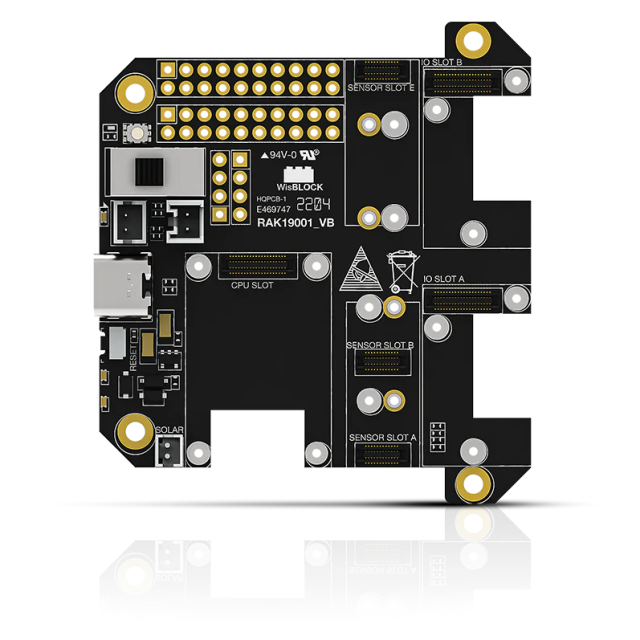

# Radio Mapping with LoRaWAN

I am working on a community project based in Australia that has been so far a blast. So I thought I'd share the basics of the project. The main idea is that there's a community radio station somewhere in the boondocks, and the locals don't always get good reception. So some of the guys thought it would be cool to build a mapper for this radio station. And since this area has great LoRaWAN coverage – they have covered the region with gateways – the logical choice was to make a LoRaWAN radio mapper.

## The Original BOM

### FM Radio

The most important part of course is to be able to receive the radio channel, and get information about it. SiliconLabs has a great FM radio receiver, the Si4703, and it's available as a ready-to-use module from a couple of companies, namely Sparkfun and Mikroe. I am a big fan of Mikroe product range called the Clicks – maybe less so of the rest – and since there's a [Click, QWIIC and Grove adapter](https://store.rakwireless.com/products/rak1920-sensor-adapter-module) in the Wisblock lineup, I went for [this module](https://www.mikroe.com/fm-click). The advantage of this adapter is that should we need to add more modules, I have a Qwiic and 2 Grove ports available.

### MCU

I decided to go for my favorite, the RAK4631 (nRF52849 + SX1262), as I wanted to have the option to manage the board via BLE, and get serial output there too. So I can configure the board, and see what happens, via USB, and later on via BLE. I put it on [a RAK19007](https://store.rakwireless.com/products/rak19007-wisblock-base-board-2nd-gen), the new regular base board with USB-C.

### GPS

RAK has two GNSS modules, the [RAK1910](https://store.rakwireless.com/products/rak1910-max-7q-gnss-location-sensor) (u-Blox MAX-7Q), and the [RAK12500](https://store.rakwireless.com/products/wisblock-gnss-location-module-rak12500) (u-blox ZOE-M8Q). The latter is **much** better, and can be driven via Serial1 and I2C. But I had on hand the former, and I have custom code for it, which I wrote for another project – NDA'ed so can't say :-)

### OLED

Of course it is easier to see what's happening if there's some kind of screen. To preserve battery, I went for an [SSD1306 OLED](https://store.rakwireless.com/products/rak1921-oled-display-panel). There are some good libraries around, my favorite being Larry Bank's [ss_oled](https://github.com/bitbank2/ss_oled). I use it just about everywhere.

## The Basics

With these elements in hand, I had a basic system working very quickly – I have most of the code in various pieces here and there, except for the radio – which was a new one for me. But there were a couple of libraries around, one by Sparkfun, linked to [on their hookup guide](https://learn.sparkfun.com/tutorials/si4703-fm-radio-receiver-hookup-guide), and another by [Github user mkhthir](https://github.com/mkhuthir/Si4703). The two libraries had some parts in common, and some that were not. Also, the Sparkfun library had the bit order of the register backwards (not their fault, they followed the official documentation). So after a little bit of grumbling and fiddling around, I managed to produce a library that worked well.

I added my skeletton `Commands.h` command system, which enables to set up a Serial command system quickly, easily extendable. I could select a channel, seek up and down, adjust volume, do an RDS scan (few radios in HK seem to transmit anything). And send packets via my gateway to TTN. All good.

*Barebones, no GPS, no OLED yet. Testing the radio, mostly.*

*GPS, OLED, the works. Testing from my balcony.*

## The Test

The first test showed a problem, not with the code or the device itself, but with the LoRaWAN coverage. I am in an area with basically ONE gateway, mine. So if I am out of reach of the gateway, what with the Godzilla buildings here, even if the radio reception is good, the data can't be transmitted to TTN, and thus forwarded to the MQTT broker. Not an issue for the community in Australia, I'm told, but who knows. We might want to prepare for the eventuality. So I went back to the drawing board.

## The extended BOM

### SD Card

First, I decided to add [an SD card module](https://store.rakwireless.com/products/sd-card-module-rak15002), and save everything locally. I had other options, like an EEPROM, or a NOR Flash, but having a removable SD card makes it easier to transfer the data, and allows me to add customs settings to the SD card, which can be read at boot time.

### New Plan, New Base Board!

With two IO modules required, I had to switch base boards, and had to go for a [RAK19001](https://store.rakwireless.com/products/rak19001-wisblock-dual-io-base-board), aka WisBlock Dual IO Base Board. This hosts two IO modules, and 6 sensors tops, including 2 long ones like the GPS module.

### Real-Time Clock

And since I wanted to timestamp everything, I also added [an RTC module](https://store.rakwireless.com/products/rtc-module-rak12002), which happens to have 43 bytes of user EEPROM – enough to save a few basic settings like favorites stations. I can synchronize the clock with the GPS - although the GPS gives me UTC – or via Serial and BLE. UTC is fine, and setting it from GPS is easier and more accurate. There are libraries, eg in Python, that can convert timestamps to whatever time zone is needed.

## How does it work?

After setting things up, OLED, LoRaWAN, BLE, Serial, and Serial1 for GPS, and the radio, the code loops between the following steps:

* Serial input: check whether there's text input incoming, and if so pass the text on to the Commands system.
* BLE input: same as Serial.
* Serial1 input: parse input from the GPS module, line by line, and send any sentence matching an NMEA verb to the corresponding function. If there's a valid GPS fix, SIV count, or UTC time, it is stored in memory, and displayed on every available channel: Serial, BLE, OLED.

But there's nothing here about the radio. So where do we take care of this? There are 2 timers, one for LoRaWAN and one for general maintenance, mostly GPS. The LoRaWAN timer looks every 30 seconds at the currently available data, and decides whether to send a packet, based on whether we have a fix, and if we do, whether it is far enough from the previous one (20 meters). If it decides to send a packet, it prepares a 10-byte buffer with GPS coordinates and the current radio RSSI, which it updates before sending. This info is also updated every time the user changes channels or the volume. The GPS timer updates the OLED display and serial outputs every so often (10 seconds currently), to avoid flooding.

Quite a few commands are available, seek up and down, volume up and down, direct frequency setting, either via a frequency or a favorite (0 to 9), RDS scan, saving and loading favorite channels. This can be done both on Serial and BLE.

## Welcome to the Other Side!

So what happens on the other side of this setup? When the packet is sent, it is, hopefully, received by my gateway, and forwarded to TTN, which hands it over to an MQTT broker. The data is ready to be picked up. This is where it gets interesting. I have a mini PC I set up at home to work as a Raspberry Pi, or more than one, really – considering it's running a headless Ubuntu server distribution, has a 256 GB SSD and 8 GB or RAM, it can do the work of a few RPis. It's perfect for such application. A small Python script with the paho mqtt library subscribes to the MQTT feed, and saves the data into an sqlite database, as well as a text file, which is used by a small HTML+JS page to display a Heat Map – based on the MapQuest API. The map is updated with every packet, and available locally. The full data can be looked at in sqlite, but the heat map, being dynamic, provides quite a bit of info.

The data can also serve as a LoRaWAN mapper, since the LoRaWAN RSSI / SNR data is also sent by the MQTT broker, and extracted by the Python script. It would be very easy to produce a second file with this data, and produce a separate map for this information.

*Radio RSSI displayed as a heat map*

