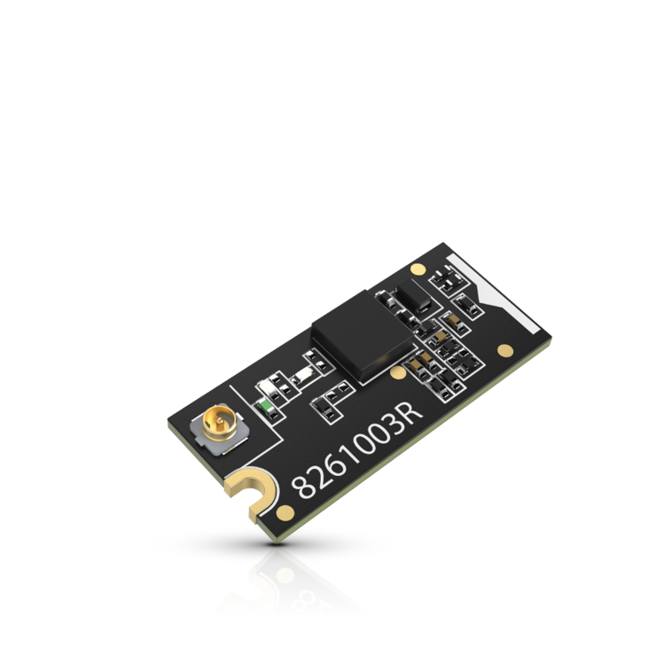
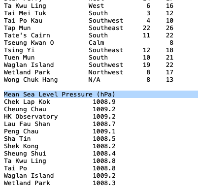
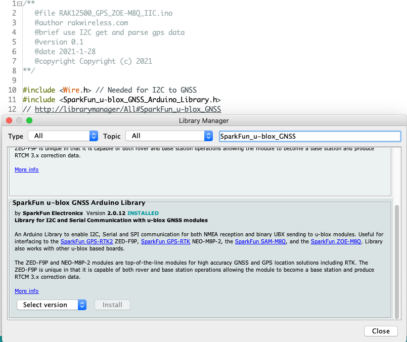
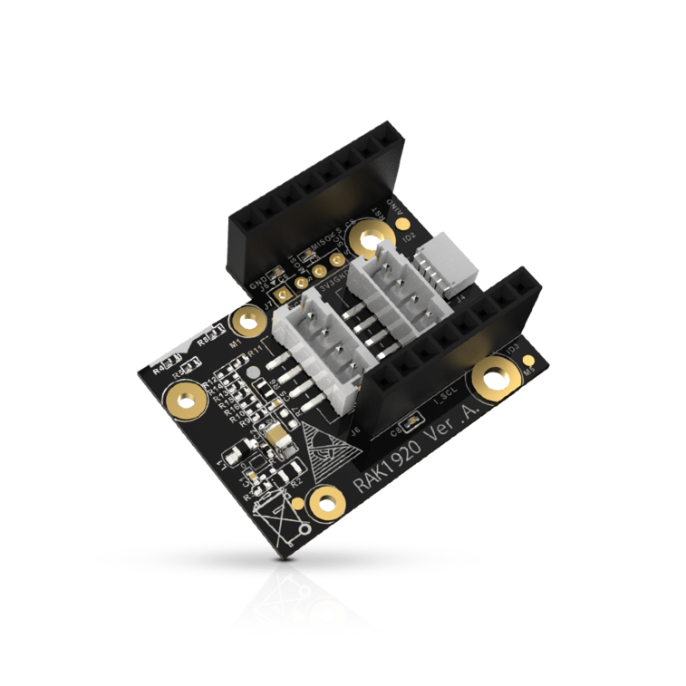
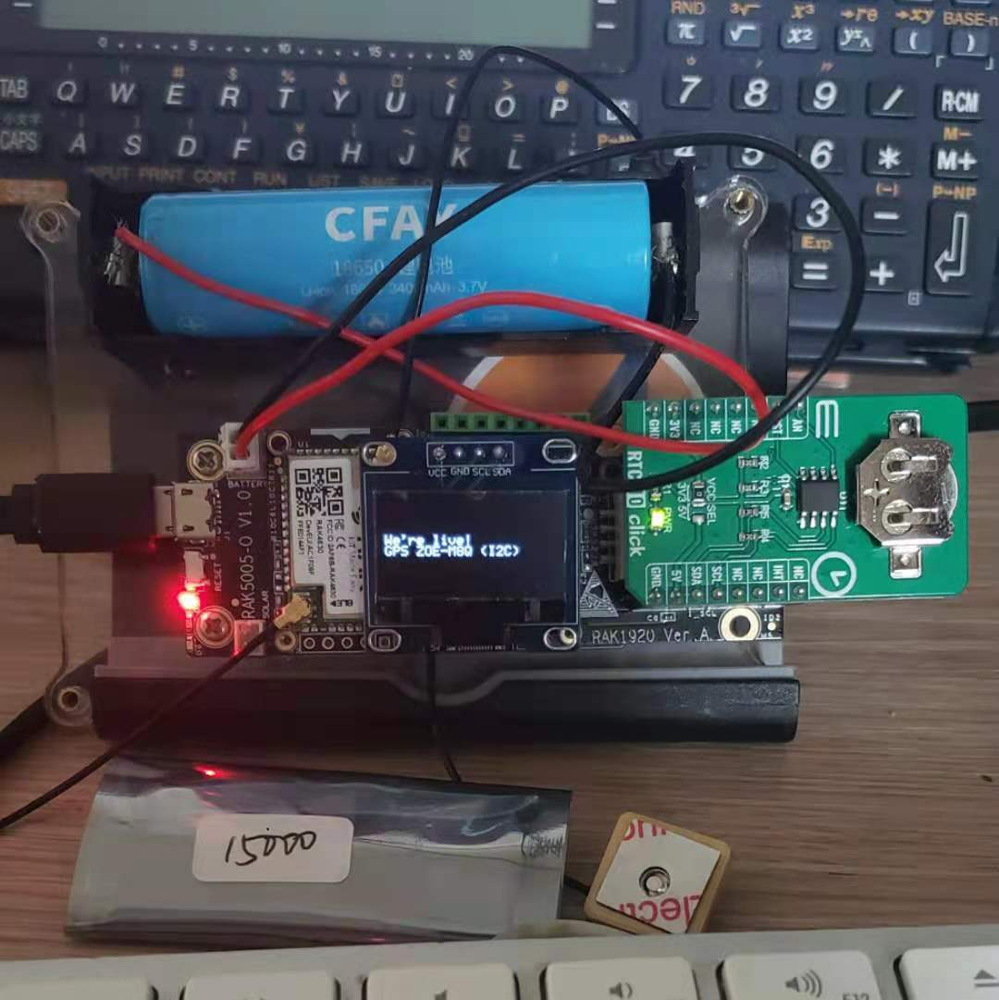

# RAK12500: A GNSS Module that talks to every satellite in sight

We have recently released the [RAK12500](https://store.rakwireless.com/collections/wisblock-sensor/products/wisblock-gnss-location-module-rak12500), a GNSS module featuring the u-blox ZOE-M8Q module, which truly talks to everybody: not only does it work with GPS, GLONASS, BeiDou and QZSS (I had to look this one up!), it works both with Serial and I2C. The latter may be a bit surprising, considering that I2C is often slower than Serial, and you need to parse a whole lot of NMEA sentences, but that's because you **don't need** to do all the hard work: the [Sparkfun library](https://github.com/sparkfun/SparkFun_u-blox_GNSS_Arduino_Library) takes care of everything, and provides you with a rich API.



As usual, our documentation center has [the goods](https://docs.rakwireless.com/Product-Categories/WisBlock/RAK12500/Quickstart/), and we have a [code example](https://github.com/RAKWireless/WisBlock/blob/master/examples/common/sensors/RAK12500_GPS_ZOE-M8Q/RAK12500_GPS_ZOE-M8Q_IIC/RAK12500_GPS_ZOE-M8Q_IIC.ino) to help you with it. But let's see if we could do a little more with it, and do a real-life test.

One cool thing about GPS and the likes is that they also carry the time, UTC. So even on a system without a Real-Time Clock, you can keep pretty accurate time, albeit in the UTC timezone. This can be useful when logging data (or sending it over with LoRa): You can recalculate the proper local time either with a library like [Timezone_Generic](https://github.com/khoih-prog/Timezone_Generic), or semi-manually – I am in HK, GMT + 7, with no summer/winter time, so it is pretty easy. YMMV. And once you got a fix, the GNSS module's RTC keeps the time updated, even if you have 0 satellites in view, as long as it is powered on.

Then, having your location is useful when you're doing LoRa distance tests and geolocation: when you get a PING, you create a log entry, with the time and coordinates, and you can also display (and log) the distance with the haversine formula. I've been using this for 2 things: one, the obvious one, to calculate the distance between the sender and the receiver – my senders add the "home" location to their json packets.


### Sidetrip: Altitude and BM(PE)280

But there's something else I've been making great use of that's not related to distance testing. In Hong Kong, the Observatory, HKO, has a [poor-man's API](https://www.hko.gov.hk/textonly/v2/forecast/text_readings_e.htm) (aka text version, hello text scraping!) for data from their stations. So, if you're in HK and are using like me (of course!) a BMP280 or BME280, you get the pressure from the device. Most libraries make offer a faulty function to calculate altitude: it is based on an artificial Mean Sea Level Pressure, which has probably nothing to do with the reality (see below). I explained this in [my PR for a fix for SeeedStudio's BMP280 library](https://github.com/Seeed-Studio/Grove_BMP280/issues/6#issuecomment-795108710) – noting that it was the case for BME280, but they never fixed it in the other library, sigh...



So now that I had an accurate (enough) way to calculate altitude, I needed a reference MSL Pressure to work. This is where having the haversine formula comes into play: with the location of all HKO stations known, it is child's play to decide which station is closest to you, and get that station's MSL Pressure from the text version. This requires an Internet connection of course – which isn't available on a RAK4630, but we have a couple of solutions: either add a [WisBlock Wi-Fi Interface Module
](https://store.rakwireless.com/collections/wisblock-wireless/products/rak2305-wi-fi-extension-board), which gives you WiFi, or a [WisBlock NB-IoT Interface Module](https://store.rakwireless.com/collections/wisblock-wireless/products/rak5860-lte-nb-iot-extension-board) for NB-IoT. The latter module also gives you GNSS, so that's a bit overkill.

I went a slightly different way: a BLE connection to my phone, and an Android Cordova app that does a few things: logging the PINGs, and providing services for the device: getting MSL Pressure from HKO, time sync, GNSS when the device doesn't have a module, etc. We'll come back to this in another blog post – for now, we're talking RAK12500!

### Setup

The first thing you'll need is to install the GNSS library:

```c
#include <Wire.h> // Needed for I2C to GNSS
#include <SparkFun_u-blox_GNSS_Arduino_Library.h>
// http://librarymanager/All#SparkFun_u-blox_GNSS
```

I'm quoting first the code from the example mentioned above, because there's a neat trick in recent versions of the Arduino IDE. If you make a comment with an http link starting with `http://librarymanager/All#`, followed by the name of the library, or a good search term, it opens the library manager for you and does the search. As you can see below, there are actually TWO libraries withe the same name – the first is labeled **DEPRECATED**. Install the other one.



When this is installed, you can start coding. You need to instantiate a GNSS object, and, in `setup()` initialize it:

```c
SFE_UBLOX_GNSS g_myGNSS;

void setup() {
  pinMode(WB_IO2, OUTPUT);
  digitalWrite(WB_IO2, 0);
  delay(1000);
  digitalWrite(WB_IO2, 1);
  delay(1000);
  // This turns on the device on slots A/B
  [...]
  if (g_myGNSS.begin() == false) {
    //Connect to the u-blox module using Wire port
    Serial.println(F("u-blox GNSS not detected at default I2C address. Please check wiring. Freezing."));
    oled.println(F("u-blox GNSS not detected.\nCheck wiring.\nFreezing."));
    while (1);
  }
  g_myGNSS.setI2COutput(COM_TYPE_UBX);
  // Sets the I2C port to output UBX only (turns off NMEA noise)
  g_myGNSS.saveConfigSelective(VAL_CFG_SUBSEC_IOPORT);
  // Saves (only) the communications port settings to flash and BBR
```

In the `loop()`, whenever you are ready to get coordinates and other satellite info, grab the data from the module. As I said, the library does all the parsing for you, you just need to get the info you want. SIV is pretty important: if it's zero, there's no GNSS data to be had, but time might still be valid, to be checked with `getTimeValid()`.

```c
  long latitude = g_myGNSS.getLatitude();
  long longitude = g_myGNSS.getLongitude();
  long altitude = g_myGNSS.getAltitude();
  long speed = g_myGNSS.getGroundSpeed();
  long heading = g_myGNSS.getHeading();
  byte SIV = g_myGNSS.getSIV();
  // Satellites In View: how many satellites the module is getting a fix from
  bool isTimeValid = g_myGNSS.getTimeValid();
  // Do we have valid datetime info?
```

We have a WisBlock RTC module, [RAK12002](https://store.rakwireless.com/products/rtc-module-rak12002), but I haven't received it yet, so I was thinking I should introduce instead a module I do have, the magnifico one-stop-shop WisBlock Sensor Adapter Module, [RAK1920](https://store.rakwireless.com/collections/wisblock-interface/products/rak1920-sensor-adapter-module).



You need to connect a Grove module or 2, I2C or one-/Two-Wire? Can, lah. Adafruit's Stemma, aka Sparkfun Qwiic? Also can. A Mikroe sensor, with their weird but convenient connector reminiscent of Zigbee? Of course lah. And that's actually what we're going to use. Back when I joined RAK, I did a survey of the competition, which means I have sensors from various companies, including a Mikroe RTC 10 Click. Let's use this today (I promise, I'll do a post about RAK12002!)



The little package in front is a [RAK15000](https://store.rakwireless.com/products/wisblock-eeprom-module-rak15000), an EEPROM module. This will come in handy when we reach a level where we need to store preferences and other data. I am porting right now the [Minimal_LoRa firmware](https://github.com/Kongduino/BastWAN_Minimal_LoRa) I wrote for [BastWAN](https://store.rakwireless.com/products/rak3244-bastwan-breakout-board), and this EEPROM module will be perfect for this.

Inbetween, the code is [on Github](https://github.com/Kongduino/RAK4631_RAK12500_GPS_ZOE-M8Q_I2C_OLED). Here it is in action: the altitude is a bit off, later on it recalibrated itself to 157 meters, which sounds just about right. It had 12 SIV, which is probably the most I ever had...


